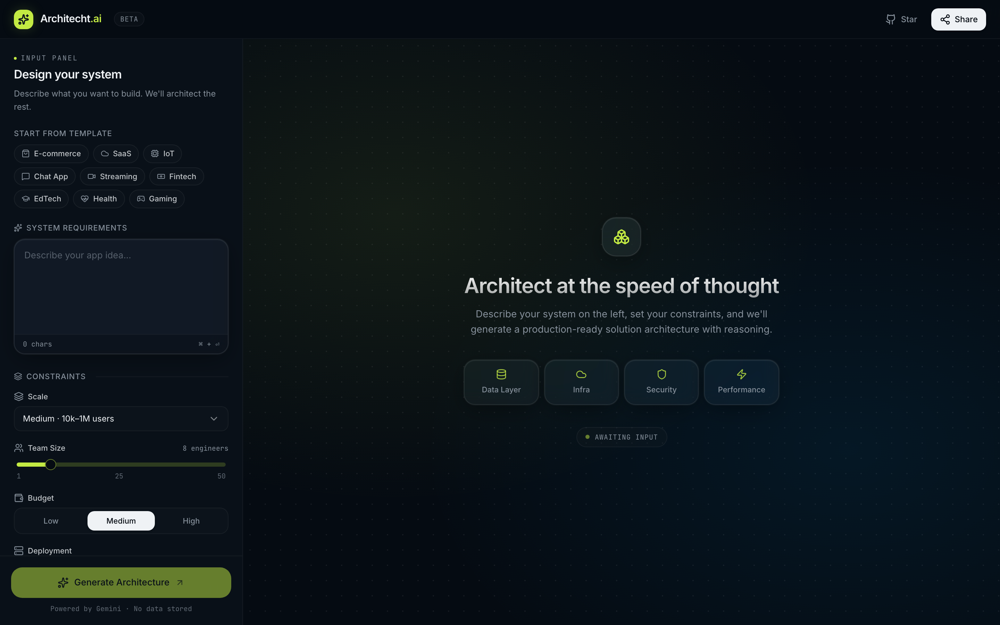
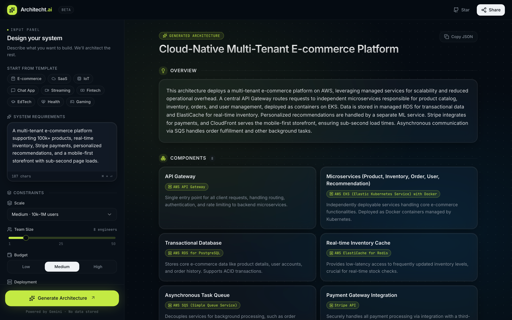
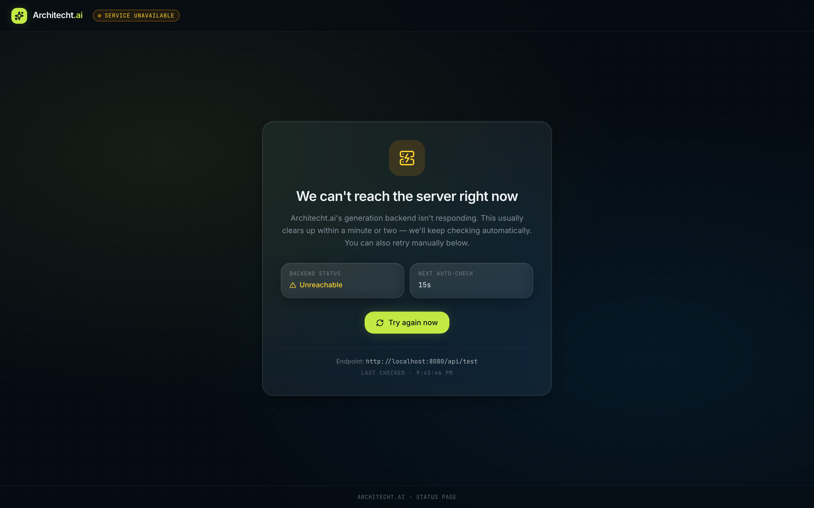

# Architecht.ai — Frontend

An AI-assisted architecture workbench. Users describe a product idea and constraints, hit **Generate Architecture**, and the app calls a Gemini-powered backend to produce a complete, opinionated solution architecture — components, tech stack rationale, design decisions, and risks.

This repository is the React/Vite frontend. It pairs with a separate Express backend that talks to the Gemini API.

---

## Screenshots

### Workbench (empty state)

Input panel on the left for requirements, templates, and constraints. The right pane explains what's about to happen.



### Generated architecture

After clicking Generate, the response is rendered as a structured report — title, overview, component grid with technology chips, tech-stack chips with hover tooltips showing the rationale, an accordion for design decisions, and amber warning cards for risks.



### Service unavailable

If the backend cannot be reached on app load (or a generate request fails with a network/5xx error), the app shows a dedicated full-screen status page. It auto-rechecks every 15 seconds and exposes a manual retry.



---

## What this project does

- Collects system requirements through a guided input panel (with quick-start templates: E-commerce, SaaS, IoT, Chat, Streaming, Fintech, EdTech, Health, Gaming).
- Captures delivery constraints — scale, team size, budget, and deployment mode — and composes them into a human-readable string sent to the backend.
- Calls `POST /api/generate` on the backend and renders the response as a rich, scannable architecture report.
- Falls back to a branded **Service Unavailable** page when the backend is down, with an auto-retry loop and visible countdown.
- Shows toast notifications for transient failures and the final "service is back online" recovery.

## Tech stack

- **React 19** + **TypeScript** for UI and component logic
- **TanStack Router** / **TanStack Start** for routing and the app shell
- **Tailwind CSS v4** with custom design tokens (glass, dot-grid, gradient mesh)
- **Radix UI** primitives wrapped in shadcn-style components
- **Framer Motion** for transitions and micro-interactions
- **lucide-react** icons
- **sonner** for toast notifications
- **Vite 7** for development and builds
- **Cloudflare Workers** deployment via `@cloudflare/vite-plugin` (config included)

## Architecture (frontend)

```
┌──────────────────────────────────────────────────────────┐
│  __root.tsx          mounts <TooltipProvider> + <Toaster>│
│  └─ index.tsx        gates Workbench on /api/test ping   │
│      ├─ down         → <ServiceUnavailable/>             │
│      └─ up           → <Workbench/>                      │
│          ├─ Header                                       │
│          ├─ InputPanel  → onGenerate(payload)            │
│          └─ OutputDisplay (empty | loading | result | err)│
└──────────────────────────────────────────────────────────┘

src/lib/api.ts
  ├─ pingHealth()             GET  /api/test  (5s timeout)
  └─ generateArchitecture()   POST /api/generate
```

The route handler holds all generation state, composes a `constraints` string from the input panel's selections, performs the fetch via `AbortController` (so re-submits cancel in-flight requests), and routes errors either to the inline error state (4xx) or to the full-screen service-unavailable page (network errors / 5xx).

## App flow

1. App boots. `pingHealth()` is called against the backend.
2. **If unreachable** → render `ServiceUnavailable`. Auto-retry every 15s with a countdown; manual "Try again now" button forces an immediate check. On success, toast `Service is back online` and the workbench appears.
3. **If reachable** → render the workbench. User picks a template or types requirements, adjusts constraints, hits **Generate Architecture**.
4. Loading state shows the staged "Gemini is thinking…" animation while the backend calls Gemini with `responseSchema` enforcement.
5. Result renders with framer-motion enter animations:
   - Title with **Generated Architecture** badge + **Copy JSON** button
   - Overview card
   - Component grid with technology chips
   - Tech-stack chips (hover for rationale tooltip)
   - Design decisions accordion (multi-open)
   - Amber warning cards for risks + mitigations

## Project structure

```
src/
├── routes/
│   ├── __root.tsx              app shell, head/meta, providers
│   └── index.tsx               main route — health gate + generation
├── components/
│   ├── workbench/
│   │   ├── Header.tsx          branded header (Star → GitHub, Share)
│   │   ├── InputPanel.tsx      requirements + constraints (no API logic)
│   │   ├── OutputDisplay.tsx   empty / loading / result / inline error
│   │   └── ServiceUnavailable.tsx  full-screen status page
│   └── ui/                     shadcn-style Radix wrappers
├── lib/
│   ├── api.ts                  typed Architecture client + pingHealth
│   └── utils.ts                cn() helper
├── hooks/
│   └── use-mobile.tsx          viewport hook
├── router.tsx                  router init + global error UI
├── routeTree.gen.ts            auto-generated by TanStack Router
└── styles.css                  Tailwind v4 + tokens (glass, dot-grid)
```

## API contract

The frontend calls a single endpoint. Full request/response schema lives in the backend repo's `API_DOCS.md`.

```
POST {VITE_API_URL}/api/generate
Content-Type: application/json

{ "requirements": "...", "constraints": "..." }
```

Returns an `Architecture` object containing `architectureName`, `overview`, `components[]`, `techStack[]`, `designDecisions[]`, and `risks[]`.

A health check uses:

```
GET {VITE_API_URL}/api/test  →  { "status": "working" }
```

## Running locally

### Prerequisites

- Node.js 18+
- The backend running on `http://localhost:8080` (see the backend repo)

### Configure

Copy the example env file and adjust if needed:

```bash
cp .env.example .env
```

```ini
VITE_API_URL=http://localhost:8080
```

### Install and run

```bash
npm install
npm run dev
```

The dev server prints its local URL (typically `http://localhost:8080` or the next free port).

### Build, lint, format

```bash
npm run build      # production bundle
npm run lint       # eslint
npm run format     # prettier
```

## Deployment

The project ships with `wrangler.jsonc` for Cloudflare Workers / Pages deployment via `@cloudflare/vite-plugin`. Set `VITE_API_URL` in the deployment environment to point at your hosted backend.

## Status

- Real Gemini-backed generation via `/api/generate` (schema-enforced JSON).
- Service-unavailable page with health check + auto-retry.
- Full result rendering with chips, tooltips, accordion, and risk cards.
- Copy-JSON, retry on inline errors, abort on re-submit.
- All UI work uses shadcn-style Radix primitives — no bespoke a11y.
